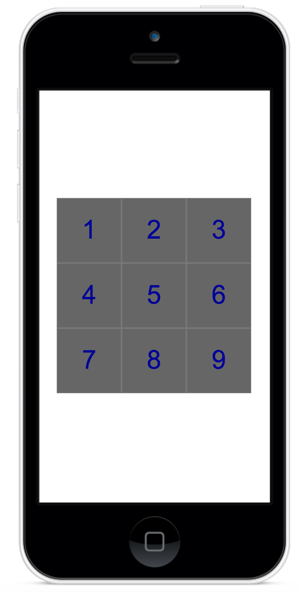
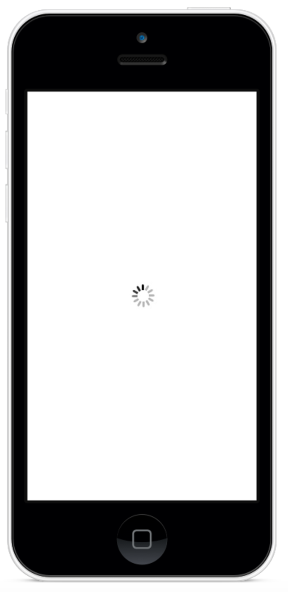
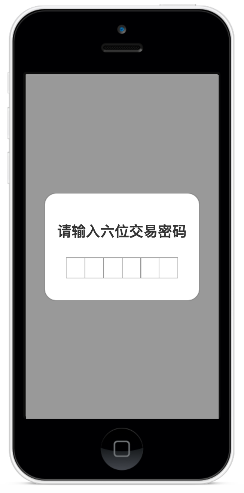
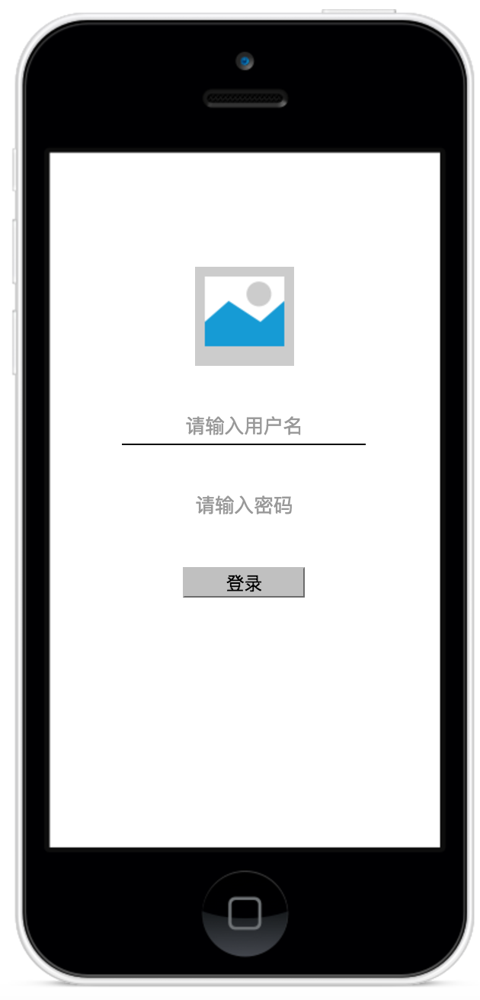

### 练习布局

#### 题目1 - app整体布局

自学React Native图片组件，配合布局技巧完成下图界面。图片组件网址[图片组件文档](http://reactnative.cn/docs/0.42/image.html#content)
要点：
* 图片需要垂直居中
* 下面的footer， 三组文字需要均匀分布
* Header高度44, Footer高度48

#### 题目2 - Number Pad
根据学到的布局知识，学一个数字键盘

#### 题目3 - Loading效果
根据学到的布局知识写一个居中的loading效果， 

[Loading组件文档](http://reactnative.cn/docs/0.42/activityindicator.html#content)

#### 题目4 - 交易密码组件布局
写一个弹出层交易密码组件， 不要求有任何交互，实现布局即可。 此组件需要垂直居中。 

#### 题目5 登录界面
自学Input组件实现一个登录界面， [组件文档](http://reactnative.cn/docs/0.42/textinput.html#content)

