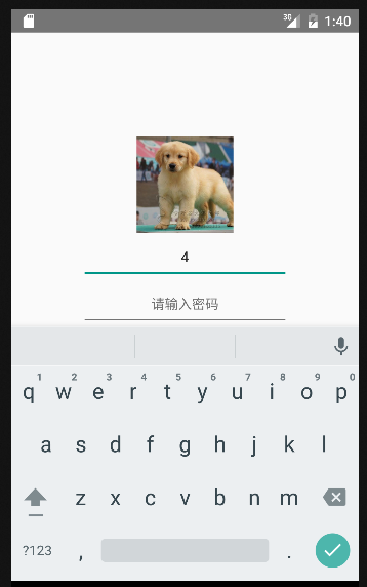
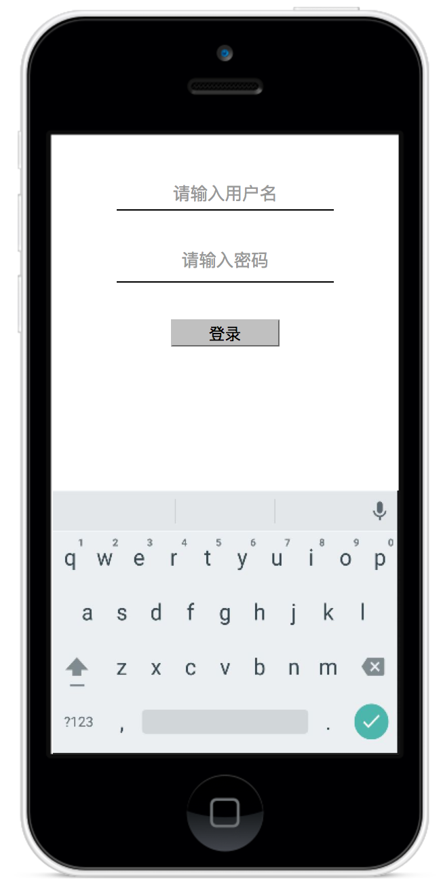
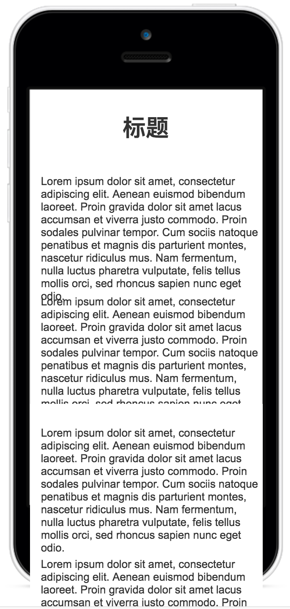
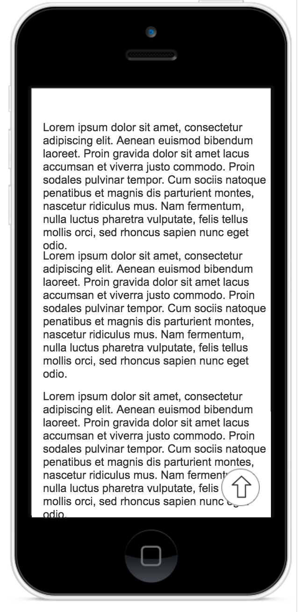

## 交互训练1

在开始训练之前请已经学习了:

* 属性状态和组件声明
* React生命周期
* React Native 事件概述

** 目标 **
学习使用React Native制作交互体验

### 训练1: 表单页面交互

在上次训练中，制作了一个表单。 如今需要为它增加一些交互功能

如图，在上一次的作业中，当用户想要输入的时候弹出键盘，键盘整体浮动上来会让整个设计比较拥挤。

因此需要在原有基础上补充一个交互， 在用户准备输入的时候将原有的图片隐藏掉，然后把输入框推上去。

React Native 提供了键盘事件监听的库: [Keyboard](http://reactnative.cn/docs/0.42/keyboard.html#content)

### 训练2：
使用ScrollView制作一个较长的页面，文本自己准备，需要有段落的感觉。  [ScrollView](http://reactnative.cn/docs/0.42/scrollview.html#content)

制作完成后，实现一个返回顶部的按钮。 要求如下：
1. 点击该按钮返回顶部（参考ScrollView文档）
2. 在向上滑动过程中不显示这个按钮 监听onScroll
3. 在向下滑动过程中线上这个按钮 监听onScroll

### 训练3
使用ViewPagerAndroid(Android)和ScrollView(IOS)实现一个轮播图。
使用windows的学员只需要完成android部分。

[ViewPagerAndroid](http://reactnative.cn/docs/0.42/viewpagerandroid.html#content)
