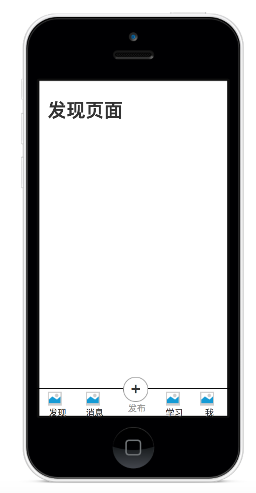

## 训练5

### 习题1  锻炼阅读源代码的能力

继续上周完成这个题目。

源代码阅读第一步就是要弄清楚技术选型，js项目弄清楚技术选型最快的途径就是看package.json。 题目如下：

1. 查阅react.js和Vue.js源代码，找到package.json。(提示：在github上)
2. 分析package.json中dependencies和devDependencies中所有的依赖， 通过查阅资料（提示: github和npm官网），弄清楚每个依赖的作用。
3. 列一个表格，左边是依赖名称，右边是依赖作用

### 习题2 重构练习

根据架构课 1-3 讲的7个概念重构training5的第三题

1. component 组件
2. screen 页面
3. globals 全局变量/函数
4. api 接口
5. util 工具函数/类
6. container 网络请求容器
7. router 路由

### 习题3 交互练习

如图

看图制作一张页面。

1. 图片自选
2. 颜色自选
3. 要求选中的Tab有高亮颜色
4. 点击Tab进行切换
5. 点击+号的交互:  "+"号旋转300ms，半周，然后从底部推上去一个弹层

 
